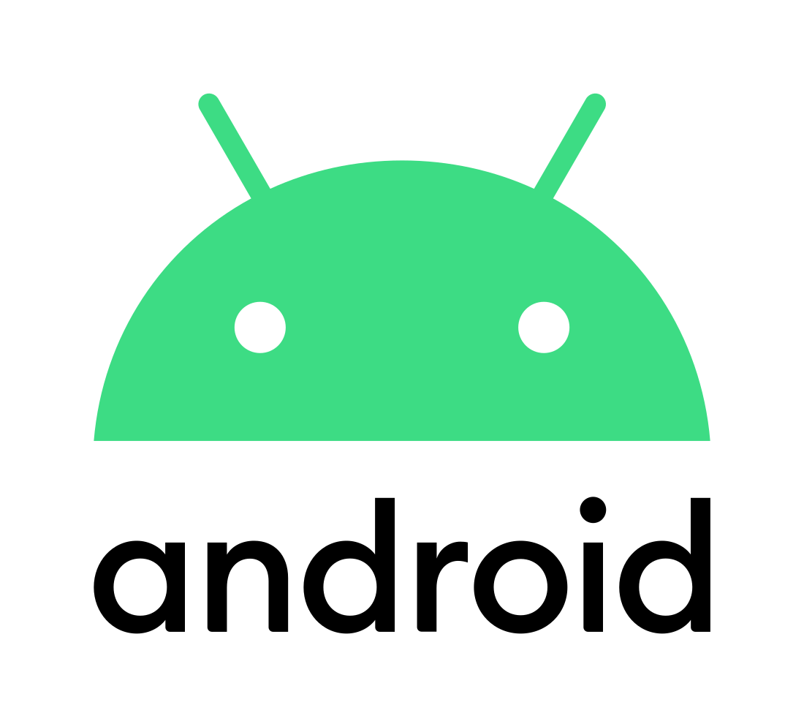
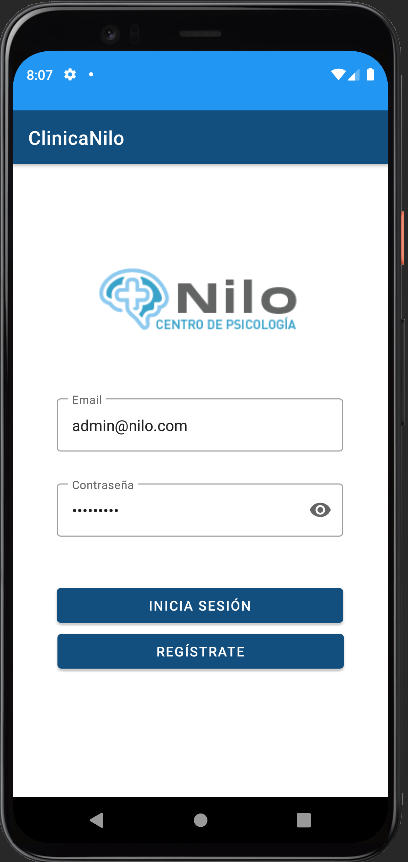
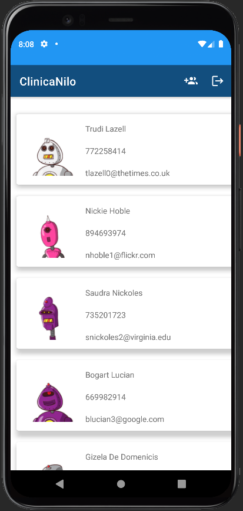
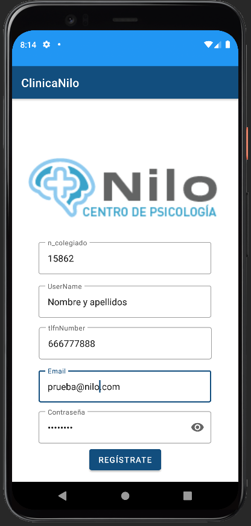
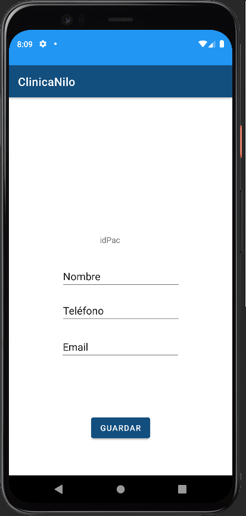
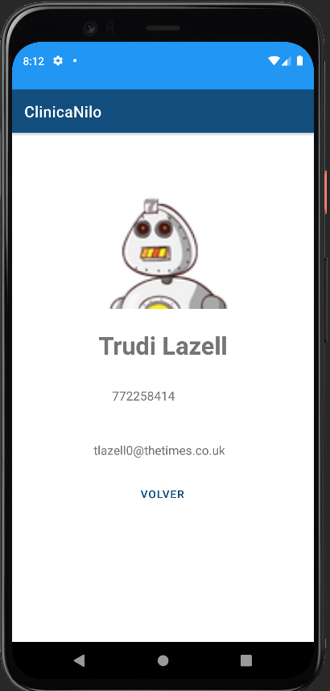

# ClinicaNiloAndroidApp

 

Aplicación desarrollada con Kotlin en AndroidStudio para la primera evaluación de la asignatura de Programación Multimedia en Dispositivos Móviles del CFGS de Desarrollo de Aplicaciones Multiplataforma (IES Campanillas).

En esta primera versión, se podrán gestionar los datos de contacto de los pacientes de la clínica.
Para acceder a la aplicación será necesario estar registrado con un email y una contraseña.
Una vez iniciado sesión, se podrán añadir, editar y borrar pacientes.

### Capturas de pantalla:

  
 
